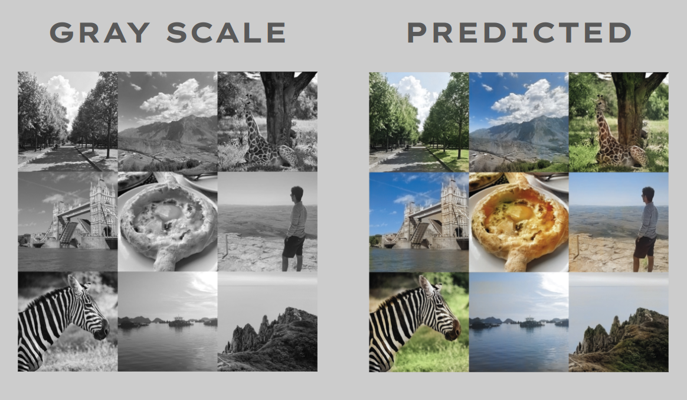
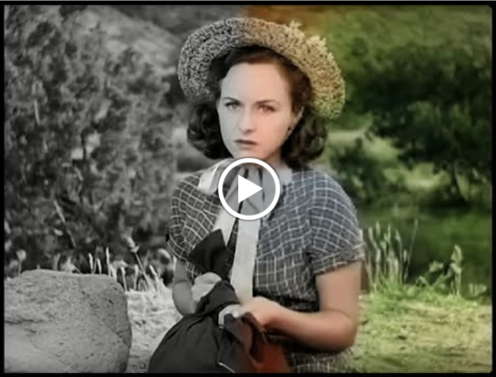
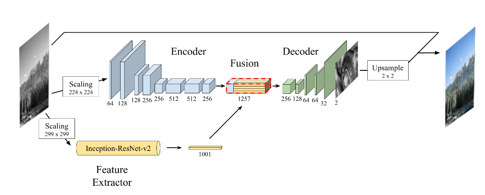
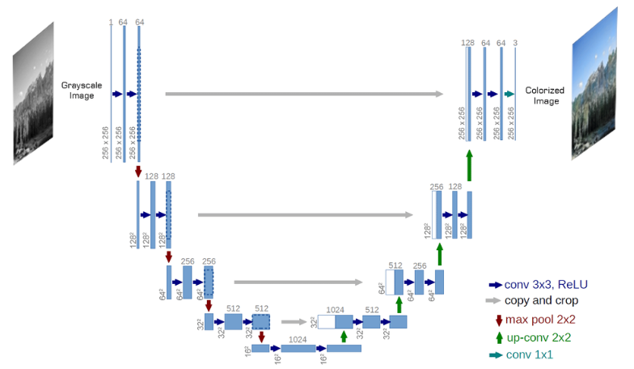
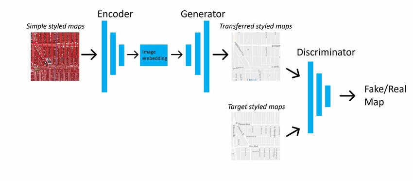

# DeepColor

### [GitHub link](https://github.com/ArnoBen/DeepColor)

Project for colorizing grayscale pictures and comparing 3 different neural networks:
- [Deep Koalarization](https://arxiv.org/abs/1712.03400): Encoder-Decoder + Inception Resnet fusion classifier 
- Unet with Resnet50 backbone
- [Pix2Pix](https://arxiv.org/abs/1611.07004) GAN

## Versions

- keras (2.8.0)
- matplotlib (3.5.2)
- numpy (1.23.4)
- opencv (4.6.0)
- tensorboard (2.8.0)
- tensorflow (2.8.2)
- tqdm (4.64.1)

## Some results
### Colorizing pictures



### Colorizing video

[](https://youtu.be/ibwZja2HmoQ?t=12)

## Architectures diagrams
### Deep Koalarization



### Unet



### Pix2Pix



## How to use
```
usage: main.py [-h] [-d] [-t TRAIN] [-m MODEL] [-c COLORIZE] [-v VIDEO]

optional arguments:
  -h, --help            show this help message and exit
  -d, --debug           set log level to debug
  -t TRAIN, --train TRAIN
                        train a model
  -m MODEL, --model MODEL
                        choose the model to train between 'fusion', 'unet',
                        'gan'
  -c COLORIZE, --colorize COLORIZE
```